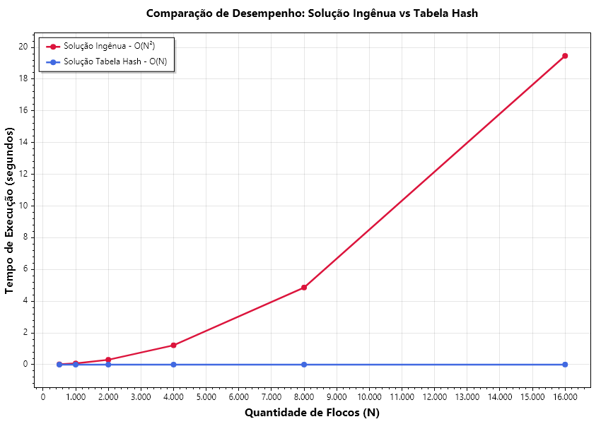

# Problema dos Flocos de Neve — Comparação de Tempo de Execução (AED)

Este projeto é uma implementação em C# da **Atividade 4** da disciplina de **Algoritmos e Estruturas de Dados (AED)**. O objetivo principal é comparar empiricamente e teoricamente o desempenho de duas abordagens para o problema dos flocos de neve: a **Busca Ingênua (Força Bruta - `O(N²)` )** e a **Busca com Tabela de Dispersão (Hash - `O(N)` )**.

---

## Pré-requisitos para rodar o projeto

Para compilar e rodar este projeto, é necessário ter o **.NET SDK** instalado no seu computador.

### 1. Como instalar o .NET SDK

1. Acesse o site oficial da Microsoft: [https://dotnet.microsoft.com/download](https://dotnet.microsoft.com/download)
2. Baixe o instalador do **.NET SDK** (versão 8.0, 9.0 ou 10.0) compatível com seu sistema operacional (Windows, macOS ou Linux).
3. Execute o instalador baixado e siga o assistente padrão ("Avançar" até concluir).

### 2. Verificar a instalação
Abra o seu terminal (Prompt de Comando, PowerShell ou Terminal do VS Code) e digite:

```bash
dotnet --version
```
Se a instalação estiver correta, será exibida a versão do SDK instalada (por exemplo: `10.0.xxx` ou `8.0.xxx`).

---

## Como Executar o Projeto

### No VS Code / Terminal:

1. Abra a pasta raiz do projeto (`flocos-neve-aed`) no VS Code ou no seu terminal de preferência.
2. Abra o terminal integrado (`Ctrl + '` no VS Code).
3. Execute o comando:

```bash
dotnet run
```

> **Nota:** O comando `dotnet run` restaura automaticamente todas as dependências e bibliotecas do projeto (como o `ScottPlot` para geração de gráficos), compila o código e executa todo o fluxo de testes e benchmarks.

---

## O que o programa faz ao rodar?

Ao executar `dotnet run`, o programa realiza automaticamente 4 etapas:

1. **Geração das Instâncias**: Cria todos os arquivos de teste `.txt` dentro de `instancias_flocos/instancias/` utilizando sementes determinísticas para garantir testes consistentes e reprodutíveis.
2. **Medição de Desempenho (Tarefa 3)**: Executa os dois algoritmos para N ∈ [500, 1000, 2000, 4000, 8000, 16000], calculando o menor tempo de 3 repetições e exibindo uma tabela formatada no console.
3. **Geração do Gráfico (Tarefa 4)**: Cria o gráfico de linhas comparativo (Tempo vs N) com as duas curvas e salva a imagem em:
   * `output/grafico_comparativo.png`
4. **Coleta de Dados e Respostas de Análise (Tarefa 5)**: Analisa o crescimento N → 2N (5a), testa a posição do par gêmeo no início vs fim com N = 2.000 (5b) e analisa a viabilidade da instância grande com N = 100.000 (5c).

---

## Resultados das Medições - Tarefa 3

> **Nota sobre o Hardware:** Os tempos em segundos apresentados abaixo foram medidos na **máquina de testes local** (processador executando em ambiente Windows x64). Os tempos absolutos podem variar de computador para computador dependendo do processador, mas as taxas relativas de crescimento assintótico (~4x e ~2x) são universais.

| N | Tempo Solução Ingênua | Tempo Tabela Hash | Speedup (x mais rápido) |
| :---: | :---: | :---: | :---: |
| **500** | 0,002966 s | 0,000159 s | **18,6x** |
| **1.000** | 0,011908 s | 0,000275 s | **43,2x** |
| **2.000** | 0,048375 s | 0,000600 s | **80,7x** |
| **4.000** | 0,191085 s | 0,001189 s | **160,8x** |
| **8.000** | 0,747394 s | 0,002534 s | **294,9x** |
| **16.000** | 2,978745 s | 0,002548 s | **1.168,9x** |

---

## Gráfico comparativo - Tarefa 4



---

## Respostas das Perguntas de Análise - Tarefa 5

### a) Dobrando o valor de N, o que acontece com o tempo da solução ingênua? E com o tempo da solução com tabela hash?

Tabela de transição real medida a cada dobra de N (N → 2N):

| Transição (N → 2N) | Fator de Crescimento (Ingênua) | Fator de Crescimento (Hash) |
| :---: | :---: | :---: |
| 500 → 1.000 | **4,02x** | 1,73x |
| 1.000 → 2.000 | **4,06x** | 2,18x |
| 2.000 → 4.000 | **3,95x** | 1,98x |
| 4.000 → 8.000 | **3,91x** | 2,13x |
| 8.000 → 16.000 | **3,99x** | 1,01x |

* Na **Solução Ingênua**, o tempo **quadruplica (~4x)** a cada dobra de N, comprovando a complexidade **Quadrática `O(N²)`**. 
* Na **Solução com Tabela Hash**, o tempo aproximadamente **dobra (~2x)** a cada dobra de N, comprovando a complexidade **Linear `O(N)`**.

---

### b) Nas instâncias `floco_2000_gemeo_inicio.txt` e `floco_2000_gemeo_fim.txt`, o par gêmeo está em posições diferentes, mas o N é o mesmo. O tempo da solução ingênua muda entre as duas instâncias? Por quê? E o tempo da solução com tabela hash muda?

* **Valores medidos (N = 2.000):**
  * Gêmeo no Início (posições 0 e 3): Ingênua = `0,000000 s` | Hash = `0,000001 s`
  * Gêmeo no Fim (posições 1990 e 1999): Ingênua = `0,045692 s` | Hash = `0,000308 s`

Na **Solução Ingênua**, o tempo muda **drasticamente** (aumentando mais de 45.000x quando o gêmeo está no fim). Isso acontece porque a busca ingênua encerra a execução assim que encontra o primeiro par (*early-exit*). Quando o par está no início, o algoritmo o encontra na primeira iteração (**Melhor Caso: `O(1)`**). Quando o par está no final, precisa comparar quase todos os pares antes de encontrar (**Pior Caso: `O(N²)`**).

Na **Solução com Tabela Hash**, o tempo continua estável na faixa de fração de milissegundo em ambos os casos, já que operações de inserção e consulta em tabela hash são realizadas em tempo constante (**`O(1)`** por elemento em média).

---

### c) Seria razoável rodar a solução ingênua na instância `floco_grande_100000.txt`? Estime (sem necessariamente rodar) quanto tempo ela levaria, a partir dos tempos medidos nas instâncias menores.

**Não é razoável**, pois a busca ingênua para N = 100.000 exige aproximadamente `(100.000 × 99.999) / 2 ≈ 5.000.000.000` (5 bilhões) de comparações de flocos. 

Com base no tempo medido em N = 1.000 (~0,012 s), para N = 100.000 (100x maior), o tempo quadrático cresce 10.000x, demorando cerca de **120 segundos (~2 minutos)** apenas para uma execução da solução ingênua, enquanto a **Tabela Hash** processou os 100.000 flocos em apenas **0,017 segundos (17 milissegundos)**, sendo quase 7.000 vezes mais rápida.

---

## Estrutura de Arquivos do Projeto

```text
flocos-neve-aed/
├── Flocos.cs                         # Métodos centrais (LeInstancia, SaoGemeos, ChaveCanonica, Soluções e Benchmark)
├── Program.cs                        # Ponto de entrada (orquestra medições, tabela, gráfico e perguntas)
├── README.md                         # Este documento de instruções e relatório
├── flocos-neve-aed.csproj            # Configuração do projeto .NET e dependências NuGet (ScottPlot)
├── output/
│   └── grafico_comparativo.png       # Gráfico comparativo gerado automaticamente
└── instancias_flocos/
    ├── GerarInstancias.cs            # Gerador C# com sementes reprodutíveis
    └── instancias/                   # Arquivos .txt contendo as coleções de flocos de teste
```